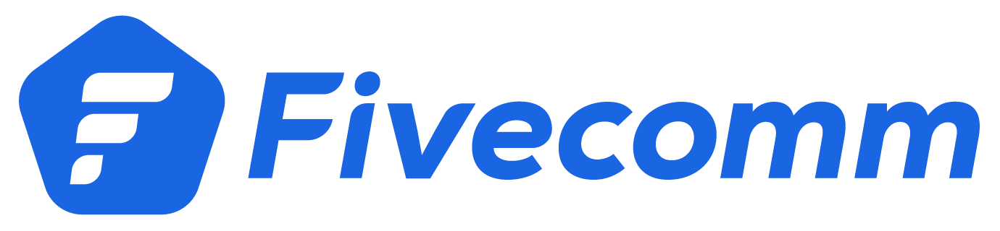

# Fidal Control Server

## Major version features
##### **v1.0.x** 
This version implements the integration of the previous proxy using Node.js in this case. It enables bidirectional communication between Unity and the robot, allowing the robot’s status information to be sent to Unity and enabling control of the robot from Unity. This setup supports multiple robots, each with its respective cockpit in Unity.

Implemented Unity-Server messaging system using UDP Socket.

Robot data from Server to Unity.
```
{
  header: 'robot',
  data: {
    battery: number;
    gps: number[];
    speed: number;
    time: number[];
    lidar: number[];
  }
}
```

Control data from Unity to Server.
```
{
  header: 'control',
  data: {
    linear: {
      x: number,
      y: number,
      z: number
    },
    angular: {
      x: number,
      y: number,
      z: number
    }
  }
}
```


This project was created using Node.js v20.11.0

